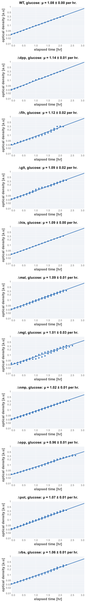
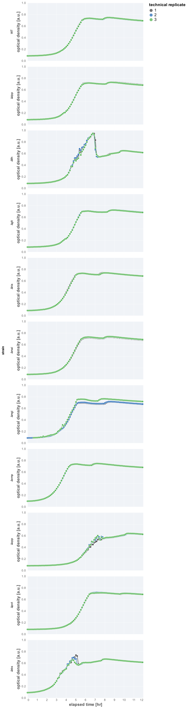

# 2021-07-23 Single KO Glucose Growth Rate Determination

## Purpose
This is an experiment measuring the rate of growth of single knockouts of 
"useless" proteins in minimal medium supplemented with glucose.

## Materials

### Growth Media
| **Label** | **Buffer Base** | **Carbon Source & Concentration** |
|:--:|:--:|:--:|
| glucose | N-C- + micronutrients | 10 mM glucose |

### Strains 
| **Label** | **Parent Strain**|  **Genotype** | **Location(s)**|
|:--: | :--:| :--:| :--:|
| WT | NCM3722 | wildtype | `GC001` |
| ∆glt | NCM3722 | gltIJKL::attL-FRT-attR | `GC030` |
| ∆flh | NCM3722 | flhDC::attL-FRT-attR | `GC029` |
| ∆rbs | NCM3722 | rbsDACB::attL-FRT-attR | `GC050` |
| ∆dpp | NCM3722 | dppABCDF::attL-FRT-attR | `GC048` |
| ∆opp | NCM3722 | oppABCDF::attL-FRT-attR | `GC053` |
| ∆mal | NCM3722 | malGEFKM+lamB::attL-FRT-attR | `GC032` |
| ∆pot | NCM3722 | potFGHI::attL-FRT-attR | `GC049` |
| ∆nmp | NCM3722 | nmpC::attL-FRT-attR | `GC052` | 
| ∆mgl | NCM3722 | mglBAC::attL-FRT-attR | `GC055` | 
| ∆his | NCM3722 | hisJQMP::attL-FRT-attR | `GC047` |

### Instrument Settings
| Instrument | BioTek Epoch2 Microplate Reader|
|:--:| :--:|
| Temperature| 37° C|
| Shaking Speed| 1096 cpm (1mm) |
| Shaking Mode | Linear |
| Shaking Duration| 7m00s|
|Read Speed| Normal|
| Read Time | 0m32s|
| Total Interval | 7m32s |
| Number of Measurements | 96 | 

### Plate Layout
| **Wells** | **Label** | **Identifier** |
|:--: | :--:  | :--: |
|C3, D3, E3 | ∆glt | `GC030` | 
|C4, D4, E4 | ∆flh | `GC029` |
|C5, D5, E5 | ∆rbs | `GC050` |
|C6, D6, E6 | ∆dpp | `GC048` |
|C7, D7, E7 | ∆opp | `GC053` |
|C8, D8, E8 | ∆mal | `GC032` | 
|C9, D9, E9 | ∆pot | `GC049` |
|C10, D10, E10 | ∆nmp | `GC052` |
|F3, F4, F5 | ∆mgl | `GC055` |
|F6, F7, F8 | ∆his | `GC047` |
|F9, F10, F11 | WT | `GC001` |

## Notes & Results
### Dropped Measurements
There were two issues in this run of the plate reader, one that's my fault 
and another was an instrument glitch, I think. 

1. While setting up the plate, I accidentally added some ∆flh sample to the 
∆glt replicate 1 well (C3). This replicate was dropped from the dataset and 
was not further analyzed. 

2. For replicate 3 of ∆mgl (well F5), there was an obvious and aberrant spike 
in the optical density within the first 6 time points. I'm not sure what it is, but
these points were dropped from the analysis, with the remainder of replicate 3
being kept. 

### Growth Rate Inference
The experiment appears to be successful in that we were able to measure steady-state
exponential-phase growth for WT and the single knockouts using the plate reader.
Doing a cursory analysis of the growth rates (meaning, a simple regression rather 
than a formal Bayesian analysis), we find the following growth rates:

| **strain** | **growth rate, µ [per hr]** |
|:--: |:--:|
|WT | 1.080 ± 0.003 |
|∆dpp | 1.143 ± 0.007 |
|∆flh | 1.12 ± 0.02 | 
|∆glt | 1.09 ± 0.02 |
|∆his | 1.091 ± 0.004|
|∆mal | 1.09 ± 0.02 |
|∆mgl | 1.01 ± 0.03 |
|∆nmp | 1.02 ± 0.01 |
|∆opp | 0.962 ± 0.009 |
|∆pot | 1.08 ± 0.01 |
|∆rbs | 1.05 ± 0.01|

### Shape of profiles
The profiles look normal, reasonable saturating optical densities and an evident 
diauxic shift to eating secreted acetate. Again, there is 
a drastic drop in the optical density for ∆flh and ∆rbs, with a smaller and les-obvious 
drop for ∆opp.  

### Plots

**Fits**

*Growth Curves**

## Protocol 
1.  Precultures were prepared by inoculating 3 mL of glucose minimal medium spiked 
with 3 µL of LB with a single colony from a fresh (< 2 week old) plate.
2. Preculture was allowed to grow at 37° C with aeration for 3 to 4 hours to an OD_600nm_ 
of approximately 0.2 - 0.3. 
3. Precultues were diluted  1:20 into fresh glucose minimal medium. Note that 
for this experimental run, the dilution medium was **not** prewarmed.  
4. A fresh 96 well plate was filled with water in blank wells. The remaining wells 
were filled with 200 µL of diluted and mixed cultures as appropriate and described in 
the section "Plate Layout".
5. The lid of the plate was loosely sealed to the plate by applying 4 strips of 
lab tape to the sides, preventing grinding of the plate while shaking. 
6. Plate was placed in the BioTek Epoch2 Plate reader and a kinetic cycle was begun 
as described in "Instrument Settings".
7. Data was saved, backed-up, exported, and analyzed using the `processing.py` and 
`analysis.py` Python scripts.
