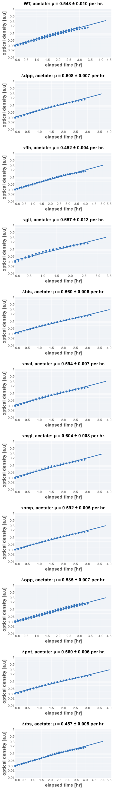
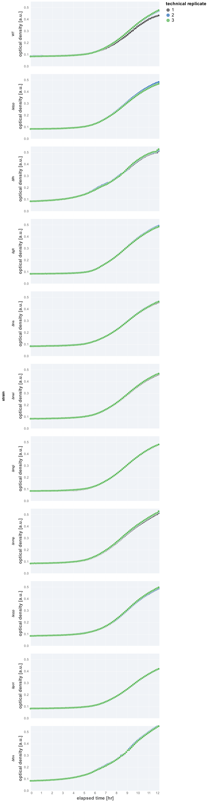

# 2021-07-27 (Run 2) Single KO Acetate Growth Rate Determination

## Purpose
This is an experiment measuring the rate of growth of single knockouts of 
"useless" proteins in minimal medium supplemented with acetate.
ss
## Materials

### Growth Media
| **Label** | **Buffer Base** | **Carbon Source & Concentration** |
|:--:|:--:|:--:|
| acetate | N-C- + micronutrients | 30 mM acetate |

### Strains 
| **Label** | **Parent Strain**|  **Genotype** | **Location(s)**|
|:--: | :--:| :--:| :--:|
| WT | NCM3722 | wildtype | `GC001` |
| ∆glt | NCM3722 | gltIJKL::attL-FRT-attR | `GC030` |
| ∆flh | NCM3722 | flhDC::attL-FRT-attR | `GC029` |
| ∆rbs | NCM3722 | rbsDACB::attL-FRT-attR | `GC050` |
| ∆dpp | NCM3722 | dppABCDF::attL-FRT-attR | `GC048` |
| ∆opp | NCM3722 | oppABCDF::attL-FRT-attR | `GC053` |
| ∆mal | NCM3722 | malGEFKM+lamB::attL-FRT-attR | `GC032` |
| ∆pot | NCM3722 | potFGHI::attL-FRT-attR | `GC049` |
| ∆nmp | NCM3722 | nmpC::attL-FRT-attR | `GC052` | 
| ∆mgl | NCM3722 | mglBAC::attL-FRT-attR | `GC055` | 
| ∆his | NCM3722 | hisJQMP::attL-FRT-attR | `GC047` |

### Instrument Settings
| Instrument | BioTek Epoch2 Microplate Reader|
|:--:| :--:|
| Temperature| 37° C|
| Shaking Speed| 1096 cpm (1mm) |
| Shaking Mode | Linear |
| Shaking Duration| 7m00s|
|Read Speed| Normal|
| Read Time | 0m32s|
| Total Interval | 7m32s |
| Number of Measurements | 96 | 

### Plate Layout
| **Wells** | **Label** | **Identifier** |
|:--: | :--:  | :--: |
|C3, D3, E3 | ∆glt | `GC030` | 
|C4, D4, E4 | ∆flh | `GC029` |
|C5, D5, E5 | ∆rbs | `GC050` |
|C6, D6, E6 | ∆dpp | `GC048` |
|C7, D7, E7 | ∆opp | `GC053` |
|C8, D8, E8 | ∆mal | `GC032` | 
|C9, D9, E9 | ∆pot | `GC049` |
|C10, D10, E10 | ∆nmp | `GC052` |
|F3, F4, F5 | ∆mgl | `GC055` |
|F6, F7, F8 | ∆his | `GC047` |
|F9, F10, F11 | WT | `GC001` |

## Notes & Results

### Growth Rate Inference
The experiment appears to be successful in that we were able to measure steady-state
exponential-phase growth for WT and the single knockouts using the plate reader.
Doing a cursory analysis of the growth rates (meaning, a simple regression rather 
than a formal Bayesian analysis), we find the following growth rates:

| **strain** | **growth rate, µ [per hr]** |
|:--: |:--:|
|WT | 0.55 ± 0.01|
|∆dpp | 0.608 ± 0.007|
|∆flh | 0.452 ± 0.004| 
|∆glt | 0.66 ± 0.001|
|∆his | 0.560 ± 0.006|
|∆mal | 0.594 ± 0.007|
|∆mgl | 0.604 ± 0.008|
|∆nmp | 0.592 ± 0.005|
|∆opp | 0.535 ± 0.007|
|∆pot | 0.560 ± 0.006|
|∆rbs | 0.457 ± 0.005|

### Shape of profiles
The curves look normal and as expected, save for replicate 1 of ∆rbs which 
had an instrument error. 

### Plots

**Fits**

*Growth Curves**

## Protocol 
1.  Seed cultures were prepared by inoculating 3 mL of LB with a single colony from a fresh (< 2 week old) plate.
2. The LB culture was allowed to grow for 4.5 hours to saturation. 
3. A preculture was prepared by diluting the seed culture 1:300 into 
prewarmed acetate minimal medium and allowed to grow for 8 hours at 37° C
to an OD_600nm_ of ≈ 0.4.
4. Precultues were diluted  1:20 into fresh acetate minimal medium prewarmed to 37° C.
4. A fresh 96 well plate was filled with water in blank wells. The remaining wells 
were filled with 200 µL of diluted and mixed cultures as appropriate and described in 
the section "Plate Layout".
5. The lid of the plate was loosely sealed to the plate by applying 4 strips of 
lab tape to the sides, preventing grinding of the plate while shaking. 
6. Plate was placed in the BioTek Epoch2 Plate reader and a kinetic cycle was begun 
as described in "Instrument Settings".
7. Data was saved, backed-up, exported, and analyzed using the `processing.py` and 
`analysis.py` Python scripts.
