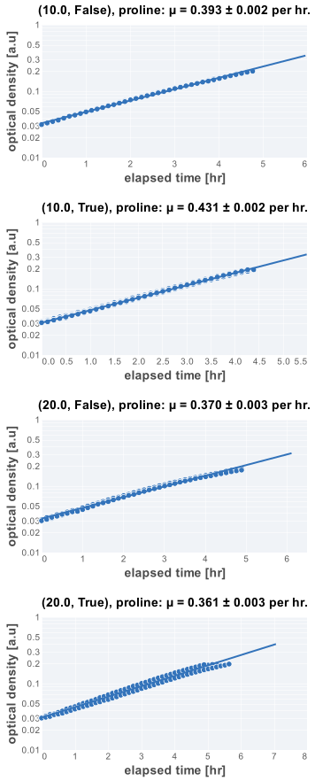
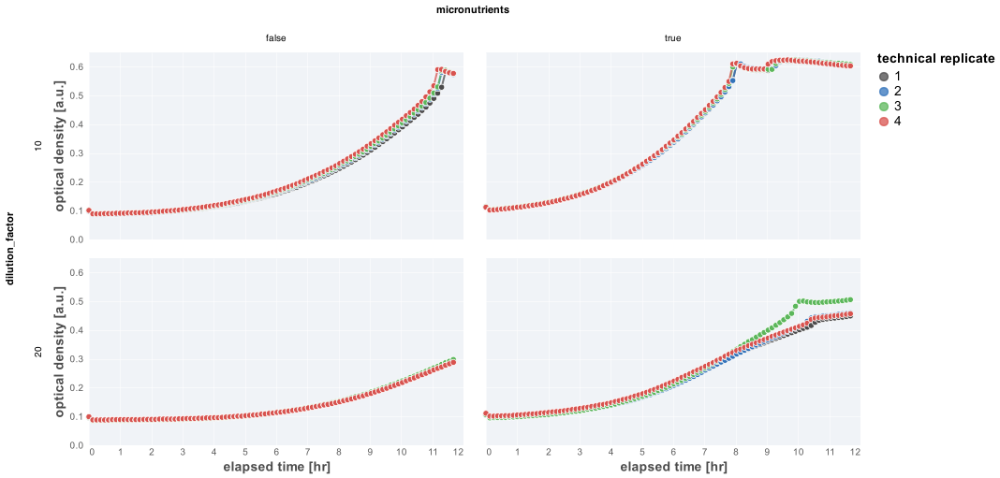

# 2021-08-11 (Run 1) WT Growth in L-Proline

## Purpose
This is an experiment measuring the rate of growth of WT *E. coli* NCM3722
growing in an L-proline minimal medium with or without micronutrients.

## Materials

### Growth Media
| **Label** | **Buffer Base** | **Carbon Source & Concentration** |
|:--:|:--:|:--:|
| glucose | N-C- +/- micronutrients | 12 mM acetate |

### Strains 
| **Label** | **Parent Strain**|  **Genotype** | **Location(s)**|
|:--: | :--:| :--:| :--:|
| WT | NCM3722 | wildtype *E. coli* NCM3722 | `GC001`|

### Instrument Settings
| Instrument | BioTek Epoch2 Microplate Reader|
|:--:| :--:|
| Temperature| 37° C|
| Shaking Speed| 1096 cpm (1mm) |
| Shaking Mode | Linear |
| Shaking Duration| 7m00s|
|Read Speed| Normal|
| Read Time | 0m32s|
| Total Interval | 7m32s |
| Number of Measurements | 94| 

### Plate Layout
| **Wells** | **Label** | 
|:--: | :--:  | :--: |
|C3, C4, C5, C6 | 1:10 dilution, + micronutrients | 
|D3, D4, D5, D6 | 1:20 dilution, + micronutrients | 
|E3, E4, E5, E6 | 1:10 dilution, - micronutrients | 
|F3, F4, F5, F6 | 1:20 dilution, - micronutrients | 

## Notes & Results
Different dilution factors were considered as the growth rate was unknown 
and it was possible that the plate reader run would conclude before measuring 
the exponential phase of growth. Even with these dilution factors in place, this 
happened, requiring the plate to be restarted. 
### Growth Rate Inference

| **condition** | **growth rate, µ [per hr]** |
|:--: |:--:|
|1:10 dilution, + micronutrients| 0.410 ± 0.002 |
|1:10 dilution, - micronutrients| 0.393 ± 0.002|
|1:20 dilution, + micronutrients | 0.361 ± 0.003 |
|1:20 dilution, - micronutrients | 0.370 ± 0.003 |

### Plots

**Fits**

*Growth Curves**

## Protocol 
1.  Seed cultures were prepared by inoculating 3 mL of LB with a single colony from a fresh (< 2 week old) plate.
2. The LB culture was allowed to grow for 4.5 hours to saturation. 
3. A preculture was prepared by diluting the seed culture 1:1000 into 
prewarmed acetate minimal medium and allowed to grow for 17 hours at 37° C
to an OD_600nm_ of ≈ 0.4.
4. Precultues were diluted  1:10  or 1:20 into fresh acetate minimal medium prewarmed to 37° C.
4. A fresh 96 well plate was filled with water in blank wells. The remaining wells 
were filled with 200 µL of diluted and mixed cultures as appropriate and described in 
the section "Plate Layout".
5. The lid of the plate was loosely sealed to the plate by applying 4 strips of 
lab tape to the sides, preventing grinding of the plate while shaking. 
6. Plate was placed in the BioTek Epoch2 Plate reader and a kinetic cycle was begun 
as described in "Instrument Settings".
7. After 12 hours, the growth was still not quite in the linear regime of the 
instrument. Another read cycle was started.
8. Data was saved, backed-up, exported, and analyzed using the `processing.py` and 
`analysis.py` Python scripts.
