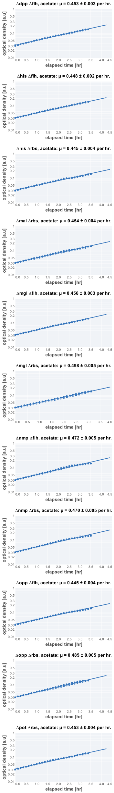

# 2021-08-17 (Run 1) Double KO Acetate Growth Rate Determination

## Purpose
This is an experiment measuring the rate of growth of the first suite of 
double KOs of  "useless" proteins in minimal medium supplemented with acetate.

## Materials

### Growth Media
| **Label** | **Buffer Base** | **Carbon Source & Concentration** |
|:--:|:--:|:--:|
| acetate | N-C- + micronutrients | 30 mM acetate |

### Strains 
| **Label** | **Parent Strain**|  **Genotype** | **Location(s)**|
|:--: | :--:| :--:| :--:|
|∆opp ∆rbs| NCM3722 | oppABCDF::attL-FRT-attR rbsDACB::attL-FRT-attR | `GC064`|
|∆mgl ∆rbs| NCM3722 | mglBAC::attL-FRT-attR rbsDACB::attL-FRT-attR | `GC079`|
|∆nmp ∆flh| NCM3722 | nmpC::attL-FRT-attR flhDC::attL-FRT-attR | `GC099`|
|∆mgl ∆flh| NCM3722 | mglBAC::attL-FRT-attR flhDC::attL-FRT-attR | `GC082`|
|∆nmp ∆rbs| NCM3722 | nmpC::attL-FRT-attR rbsDACB::attL-FRT-attR | `GC072`|
|∆his ∆rbs| NCM3722 | hisJQMP::attL-FRT-attR rbsDACB::attL-FRT-attR | `GC066`|
|∆pot ∆rbs| NCM3722 | potFGHI::attL-FRT-attR rbsDACB::attL-FRT-attR | `GC090`|
|∆mal ∆rbs| NCM3722 | malGEFKM+lamB::attL-FRT-attR rbsDACB::attL-FRT-attR | `GC085`|
|∆opp ∆flh| NCM3722 | oppABCDF::attL-FRT-attR flhDC::attL-FRT-attR | `GC067`|
|∆dpp ∆flh| NCM3722 | dppABCDF::attL-FRT-attR flhDC::attL-FRT-attR | `GC071`|
|∆his ∆flh| NCM3722 | hisJQMP::attL-FRT-attR flhDC::attL-FRT-attR | `GC068`|

### Instrument Settings
| Instrument | BioTek Epoch2 Microplate Reader|
|:--:| :--:|
| Temperature| 37° C|
| Shaking Speed| 1096 cpm (1mm) |
| Shaking Mode | Linear |
| Shaking Duration| 7m00s|
|Read Speed| Normal|
| Read Time | 0m32s|
| Total Interval | 7m32s |
| Number of Measurements |  | 

### Plate Layout
| **Wells** | **Label** | **Identifier** |
|:--: | :--:  | :--: |
|C3, D3, E3 | ∆opp ∆rbs| `GC064` | 
|C4, D4, E4 | ∆mgl ∆rbs| `GC079` |
|C5, D5, E5 | ∆nmp ∆flh| `GC099` |
|C6, D6, E6 | ∆mgl ∆flh| `GC082` |
|C7, D7, E7 | ∆nmp ∆rbs| `GC072` |
|C8, D8, E8 | ∆his ∆rbs| `GC066` | 
|C9, D9, E9 | ∆pot ∆rbs| `GC090` |
|C10, D10, E10 | ∆mal ∆rbs| `GC084` |
|F3, F4, F5 | ∆opp ∆flh| `GC067` |
|F6, F7, F8 | ∆dpp ∆flh| `GC071` |
|F9, F10, F11 | ∆his ∆flh| `GC068` |

## Notes & Results
There was a problem with the blank measurements for well G4, which was dropped 
from analysis. Some particulate matter was in that well, throwing off the OD 
readings.  

### Growth Rate Inference

| **strain** | **growth rate, µ [per hr]** |
|:--: |:--:|
|∆opp ∆rbs| 0.485 ± 0.005|
|∆mgl ∆rbs| 0.498 ± 0.005|
|∆nmp ∆flh| 0.472 ± 0.005| 
|∆mgl ∆flh| 0.456 ± 0.003 |
|∆nmp ∆rbs| 0.470 ± 0.005|
|∆his ∆rbs| 0.445 ± 0.004|
|∆pot ∆rbs| 0.453 ± 0.004|
|∆mal ∆rbs| 0.454 ± 0.004|   
|∆opp ∆flh| 0.445 ± 0.004|
|∆dpp ∆flh| 0.453 ± 0.003|
|∆his ∆flh| 0.448 ± 0.002|

### Plots

**Fits**

**Growth Curves**

## Protocol 
1.  Seed cultures were prepared by inoculating 3 mL of LB with a single colony from a fresh (< 2 week old) plate.
2. The LB culture was allowed to grow for 4.5 hours to saturation. 
3. A preculture was prepared by diluting the seed culture 1:1000 into 
prewarmed acetate minimal medium and allowed to grow for 12 hours at 37° C
to an OD_600nm_ of ≈ 0.7.
4. Precultues were diluted  1:100 into fresh acetate minimal medium prewarmed to 37° C.
4. A fresh 96 well plate was filled with water in blank wells. The remaining wells 
were filled with 200 µL of diluted and mixed cultures as appropriate and described in 
the section "Plate Layout".
5. The lid of the plate was loosely sealed to the plate by applying 4 strips of 
lab tape to the sides, preventing grinding of the plate while shaking. 
6. Plate was placed in the BioTek Epoch2 Plate reader and a kinetic cycle was begun 
as described in "Instrument Settings".
7. Data was saved, backed-up, exported, and analyzed using the `processing.py` and 
`analysis.py` Python scripts.
