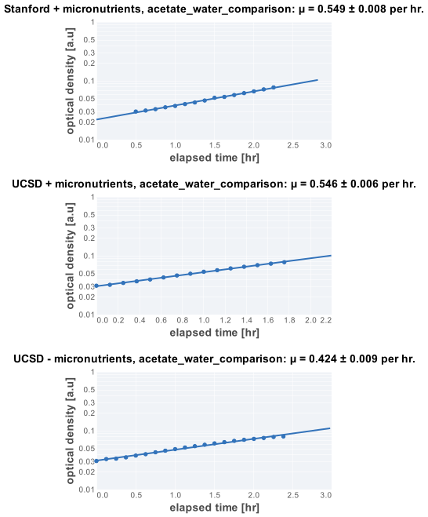
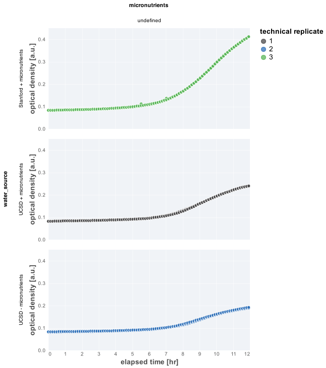

# 2021-08-31 WT Growth in Acetate With Different Water Sources 

## Purpose
This is an experiment to compare different water sources and micronutrient concentrations to see if trace elements have a large impact on the growth rate

## Materials

## Water Sources 
|**Label**| **Source** | **Notes**|
|:--:|:--:|:--:|
| UCSD +| UCSD | MQ Water from UCSD with added micronutrients|
| UCSD -| UCSD | MQ Water from UCSD with added micronutrients|
| Stanford +| Stanford | MQ Water from Stanford with added micronutrients|

### Growth Media
| **Label** | **Buffer Base** | **Carbon Source & Concentration** |
|:--:|:--:|:--:|
| acetate | N-C- +/- micronutrients | 30 mM acetate |

### Strains 
| **Label** | **Parent Strain**|  **Genotype** | **Location(s)**|
|:--: | :--:| :--:| :--:|
| WT | NCM3722 | wild-type *E. coli* NCM3722 | `GC001`

### Instrument Settings
| Instrument | BioTek Epoch2 Microplate Reader|
|:--:| :--:|
| Temperature| 37° C|
| Shaking Speed| 1096 cpm (1mm) |
| Shaking Mode | Linear |
| Shaking Duration| 7m00s|
|Read Speed| Normal|
| Read Time | 0m32s|
| Total Interval | 7m32s |
| Number of Measurements |  96 | 

### Plate Layout
| **Wells** | **Label** |
|:--: | :--:  | :--: |
|C3, D3, E3, F3 | UCSD + micronutrients|
|C4, D4, E4, F4 | UCSD - micronutrients |
|C5, D5, E5, F5 | Stanford + micronutrients |

## Notes & Results

It appears that there isi little difference in teh growth rates using different 
water sources. The primary difference comes down to whether or not there are 
micronutrients present.

### Growth Rate Inference

The inferred growth rates were as follows

| **condition** | **growth rate, µ [per hr]** |
|:--: |:--:|
|UCSD + micronutrients| 0.546 ± 0.009|
|UCSD - micronutrients | 0.424 ± 0.009|
|Stanford + micronutrients | 0.549 ± 0.008|

### Plots

**Fits**

*Growth Curves**

## Protocol 
1.  Seed cultures were prepared by inoculating 3 mL of LB with a single colony from a fresh (< 2 week old) plate.
2. The LB culture was allowed to grow for 4.5 hours to saturation. 
3. A preculture was prepared by diluting the seed culture 1:300 into 
prewarmed acetate minimal medium and allowed to grow for 5 hours at 37° C
to an OD_600nm_ of ≈ 0.2.
4. Precultues were diluted  1:20 into fresh acetate minimal medium prewarmed to 37° C.
4. A fresh 96 well plate was filled with water in blank wells. The remaining wells 
were filled with 200 µL of diluted and mixed cultures as appropriate and described in 
the section "Plate Layout".
5. The lid of the plate was loosely sealed to the plate by applying 4 strips of 
lab tape to the sides, preventing grinding of the plate while shaking. 
6. Plate was placed in the BioTek Epoch2 Plate reader and a kinetic cycle was begun 
as described in "Instrument Settings".
7. Data was saved, backed-up, exported, and analyzed using the `processing.py` and 
`analysis.py` Python scripts.
