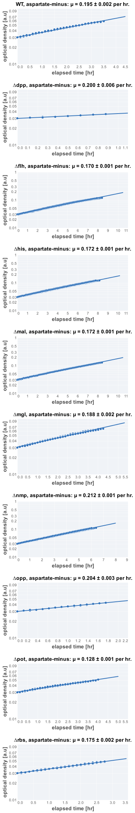
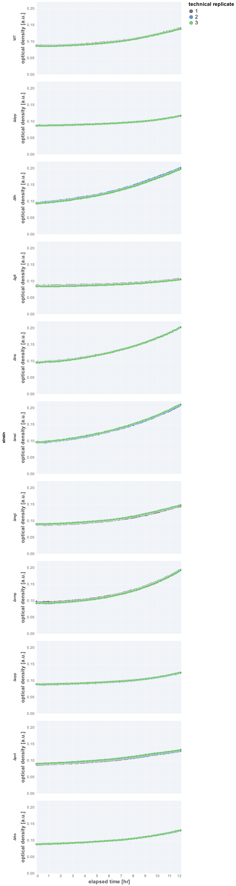

# 2022-02-16 (Run 1) Single KO Aspartate Growth Rate Determination

## Purpose
This is an experiment measuring the rate of growth of the single KOs of  "useless" proteins in minimal medium 
supplemented with aspartate but with no micronutrients.

## Materials

### Growth Media
| **Label** | **Buffer Base** | **Carbon Source & Concentration** |
|:--:|:--:|:--:|
| proline | N-C- | 20 mM proline |

### Strains 
| **Label** | **Parent Strain**|  **Genotype** | **Location(s)**|
|:--: | :--:| :--:| :--:|
|∆mal| NCM3722 | malGEFKM+lamB::attL-FRT-attR| `GC032`|
|∆pot| NCM3722 | potFGHI::attL-FRT-attR| `GC049`|
|∆nmp| NCM3722 | nmpC::attL-FRT-attR | `GC052`|
|∆his| NCM3722 | hisJQMP::attL-FRT-attR | `GC047`|
|∆rbs | NCM3722 | rbsDACB::attL-FRT-attR | `GC050`|
|∆dpp | NCM3722 | dppABCDF::attL-FRT-attR | `GC048`|
|∆opp | NCM3722 | oppABCDF::attL-FRT-attR | `GC053`|
|∆mgl| NCM3722 | mglBAC::attL-FRT-attR | `GC055`|
|∆glt | NCM3722 | gltIJKL::attL-FRT-attR | `GC030`|
|∆flh | NCM3722 | flhDC::attL-FRT-attR | `GC029`|
|WT| NCM3722 | | `GC001`|

### Instrument Settings
| Instrument | BioTek Epoch2 Microplate Reader|
|:--:| :--:|
| Temperature| 37° C|
| Shaking Speed| 1096 cpm (1mm) |
| Shaking Mode | Linear |
| Shaking Duration| 7m00s|
|Read Speed| Normal|
| Read Time | 0m32s|
| Total Interval | 7m32s |
| Number of Measurements |90 | 

### Plate Layout
| **Wells** | **Label** | **Identifier** |
|:--: | :--:  | :--: |
|C3, D3, E3 | WT| `GC001` | 
|C4, D4, E4 | ∆glt | `GC030` |
|C5, D5, E5 | ∆nmp | `GC052` |
|C6, D6, E6 | ∆mgl | `GC055` |
|C7, D7, E7 | ∆pot | `GC049` |
|C8, D8, E8 | ∆mal | `GC032`| 
|C9, D9, E9 | ∆opp | `GC053` |
|C10, D10, E10 | ∆dpp| `GC048` |
|F3, F4, F5 | ∆rbs | `GC050` |
|F6, F7, F8 | ∆flh | `GC029` |
|F9, F10, F11 | ∆his | `GC047` |

## Notes & Results
* The ∆glt samples grew very, very slowly and we were not able to infer the 
growth rate as they didn't reach an OD within the linear range of the instrument.

### Growth Rate Inference

| **strain** | **growth rate, µ [per hr]** |
|:--: |:--:|
| WT  | 0.195 ± 0.002|
|∆dpp | 0.200 ± 0.006|
|∆flh | 0.170 ± 0.001| 
|∆his | 0.172 ± 0.001|
|∆mal | 0.172 ± 0.001|
|∆mgl | 0.188 ± 0.002|
|∆nmp | 0.212 ± 0.001|
|∆opp | 0.204 ± 0.003|   
|∆pot | 0.128 ± 0.001|  
|∆rbs | 0.175 ± 0.002 |
|∆glt | Not Determined|

### Plots

**Fits**

**Growth Curves**

## Protocol 
1.  Seed cultures were prepared by inoculating 3 mL of LB with a single colony from a fresh (< 2 week old) plate.
2. The LB culture was allowed to grow for 4.5 hours to mid-exponential (OD ≈ 0.3 - 0.4)
3. A preculture was prepared by diluting the seed culture 1:1000 into 
prewarmed acetate minimal medium and allowed to grow for 26 hours at 37° C
to an OD_600nm_ of ≈ 0.3.
4. Precultues were diluted  1:10 into fresh acetate minimal medium prewarmed to 37° C. 
4. A fresh 96 well plate was filled with water in blank wells. The remaining wells 
were filled with 200 µL of diluted and mixed cultures as appropriate and described in 
the section "Plate Layout".
5. The lid of the plate was loosely sealed to the plate by applying 4 strips of 
lab tape to the sides, preventing grinding of the plate while shaking. 
6. Plate was placed in the BioTek Epoch2 Plate reader and a kinetic cycle was begun 
as described in "Instrument Settings".
7. Data was saved, backed-up, exported, and analyzed using the `processing.py` and 
`analysis.py` Python scripts.
